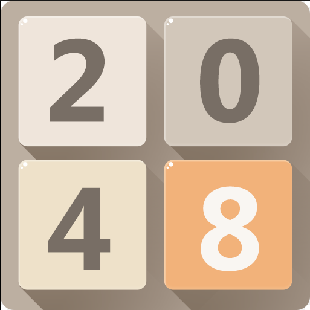
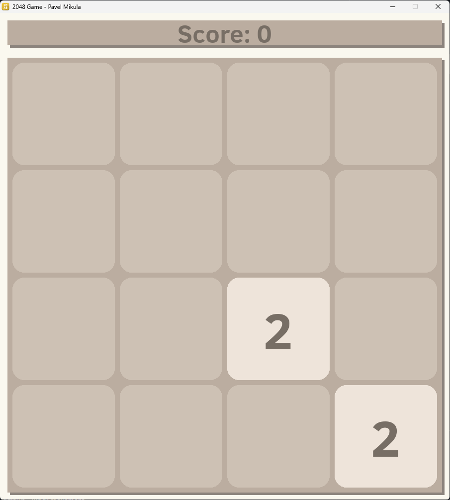
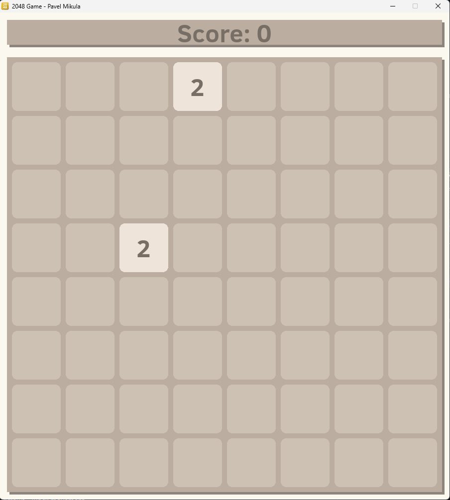

# Project for C (Copy of game 2048) 

<p>
    
    
</p>

- Author: Pavel Mikula (MIK0486)
- Took approximately 56 hours

## Project Theme
The project will be simple copy of retro game 2048, used to be played in web browser. Using SDL we create graphical environment where game will be played. 

## Requirements
 - SDL2
 - SDL2 TTF addon
 - SDL2 Image addon

## Instalation
```shell
# Clone the repository
git clone https://github.com/Firestone82/2048-clone.git
cd 2048-clone

# Install SDL2 libs
apt-get install libsdl2-dev

# Build the project or use 'make'
2) Run make file or by command
gcc *.c -o main -Wall -Wno-unused-variable -Wno-unused-parameter -ISDL2/include -LSDL2/lib -lSDL2 -lSDL2main -lSDL2_image -lSDL2_ttf
```

## Usage
 - Arguments
 	- W - Number of colls
 	    - default: 4, min: 2
 	- H - Number of rows
 	    - default: 4, min: 2
 - Start command
    - ```./main W H```
        - Example1 - ```./main```
        - Example2 - ```./main 8 8```
 - Binds
    - WASD, Arrows - Block movement
    - R - Game restart
    - T - Victory screen
    - Z - Game Over screen
    - ESC - Game quit

## Images
Example images:

<p align="center">
     
    &nbsp;
    &nbsp;
    &nbsp;
     
</p>