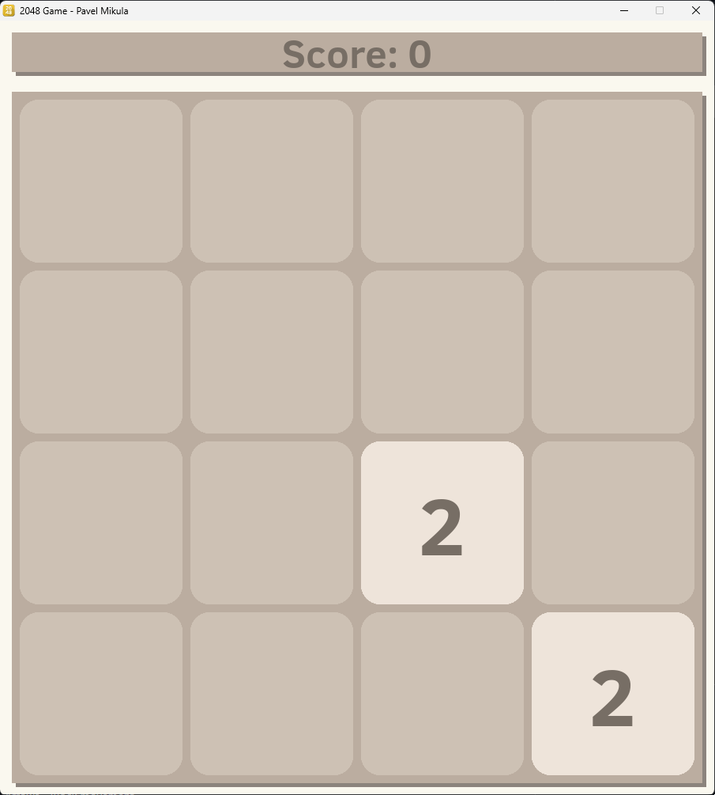
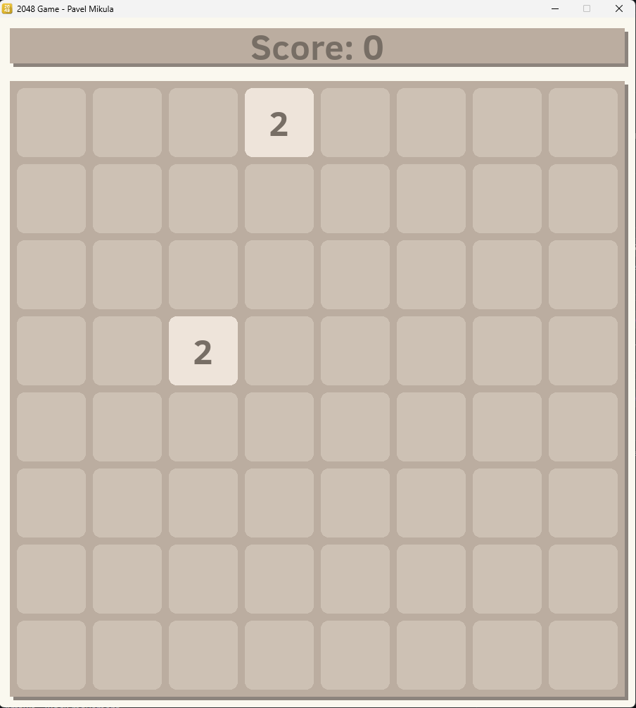

# 2048-clone

> **VŠB-TUO** — School project · Programming in C

  

A recreation of the classic 2048 sliding-tile puzzle game implemented in C using the SDL2 graphics library. Supports configurable board sizes and includes game-over and victory screens.

<p align="center">
  
  &nbsp;&nbsp;&nbsp;
  
</p>

## Requirements

- GCC or compatible C compiler
- SDL2, SDL2_image, SDL2_ttf

## Setup

1. Clone the repository:
   ```bash
   git clone https://github.com/Firestone82/2048-clone.git
   cd 2048-clone
   ```

2. Install SDL2 libraries (Debian/Ubuntu):
   ```bash
   apt-get install libsdl2-dev libsdl2-image-dev libsdl2-ttf-dev
   ```

3. Build:
   ```bash
   gcc *.c -o main -Wall -ISDL2/include -LSDL2/lib -lSDL2 -lSDL2main -lSDL2_image -lSDL2_ttf
   ```

## Usage

```bash
./main [columns] [rows]   # defaults to 4×4
./main 8 8                # 8×8 board
```

**Controls:**

| Key | Action |
|-----|--------|
| `WASD` / Arrow keys | Move tiles |
| `R` | Restart game |
| `ESC` | Exit |

## License

This project was created as a school assignment at VŠB-TUO.
